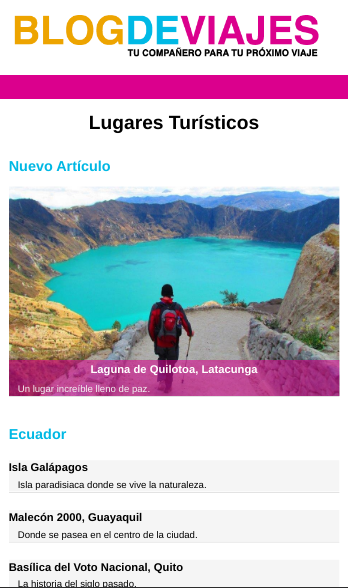

# Blog-de-viajes
Blog que permite publicar reseña de sitios turísticos.

## Pre-requisitos 📋
_Navegador de smartphone o de computadora_

## Construido con 🛠️
**(Front-End)**
* [JQuery](https://jquery.com/) - Para programación Front-End.
* [CSS](https://www.w3.org/Style/CSS/Overview.en.html) - Para la presentación del documento.
* [HTML](https://rometools.github.io/rome/) - Para la elaboración de páginas web.

**(Back-End)**
* [PHP](https://www.php.net/) - Para realizar la programación desde el lado servidor, valdiaciónes y consulta a MySql.
* [MySql](https://www.mysql.com/) - Sistema gestor de base de datos relacional usado para los planes de televisión y los clientes.
* [XAMPP](https://www.apachefriends.org/es/index.html) - Paquete de software utilizado, en donde se encuentra el servidor Apache.

**(Alojamiento)**

**(Mensajería)**

## ❤️❤️❤️ Sitio Web Descktop (_Haga click a la imagen_) ❤️❤️❤️

## ❤️❤️❤️ Sitio Web Mobile (_Haga click a la imagen_) ❤️❤️❤️

